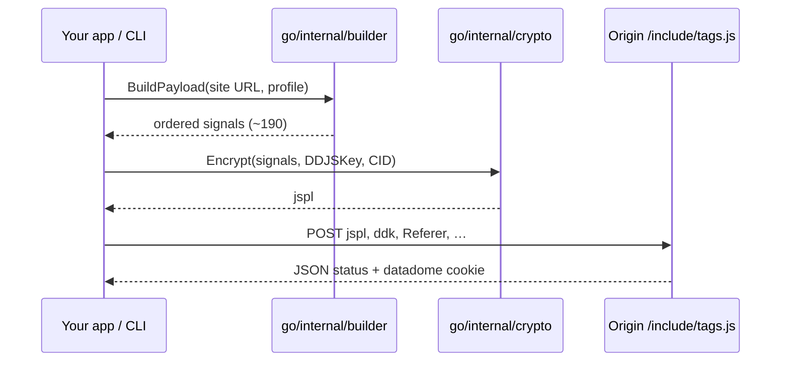

<div align="center">
    <h1>DataDome Solver</h1>
    <p>Open-source <strong>DataDome solver</strong> in Go — fingerprint generation, jspl encryption, and <code>datadome</code> cookie submission.</p>
    
    
    <br>
    <a href="https://t.me/jujucodings"></a>
    <br>
    <br>
</div>

## Introduction

Sites protected by [DataDome](https://datadome.co/) run a client script (`tags.js`) that collects ~190 browser signals, encrypts them into a **`jspl`** blob, and POSTs them to `/include/tags.js`. A valid response sets the **`datadome`** cookie used for subsequent requests.

This repository has two parts:

| Directory | Purpose |
|-----------|---------|
| [`go/`](go/) | **Solver** — CLI and library (build, encrypt, submit). No Node, no browser. |
| [`reference/`](reference/) | **Client reference** — captured `tags.js`, deobfuscated output, deobfuscator, and [`TELEMETRY.md`](reference/TELEMETRY.md). Not used at runtime by Go. |

The Go code was written against the reference client. When DataDome updates their script, refresh `reference/tags.js`, deobfuscate, diff, then adjust `go/internal/builder` and `go/internal/crypto` if needed.

---

## How it works



| Step | Location | Output |
|------|----------|--------|
| Fingerprint | `go/internal/builder` | Ordered `[]crypto.Signal` |
| Encryption | `go/internal/crypto` | `jspl` form field |
| HTTP submit | `go/pkg/datadome` | `Result.Cookie` |

**DDJS key** — Each origin exposes `window.ddjskey` (POST field `ddk`). It seeds the cipher. Read it from the live page you target.

**CID** — Optional existing DataDome client id.

**Profiles** — `chrome_win10` (default), `chrome_win10_de`. Per-signal overrides via `builder.Options.Overrides`.

---

## Repository layout

```
.
├── README.md
├── go/                              ← solver (all Go code)
│   ├── cmd/datadome/                CLI
│   ├── pkg/datadome/                Public SDK
│   ├── internal/builder/            Fingerprint signals
│   ├── internal/crypto/             jspl encryption
│   └── examples/basic/
└── reference/                       ← DataDome client (research only)
    ├── tags.js                      Captured obfuscated script
    ├── tags_deobfuscated.js         Deobfuscated output
    ├── tags_deobfuscated_strings.json
    ├── deobfuscator.js
    ├── TELEMETRY.md                 Client telemetry & signals (research)
    ├── package.json
    └── SOURCE.md                    Capture URL + date
```

---

## Install

Requires **Go 1.22+**.

```bash
git clone https://github.com/CircuitSavage/DataDome-Solver.git
cd DataDome-Solver/go
go build -o datadome ./cmd/datadome
```

---

## CLI

Run from the `go/` directory (or pass full module paths):

```bash
# Fingerprint JSON
./datadome -site https://example.com/

# jspl only
./datadome -site https://example.com/ -key <DDJS_KEY> -encrypt

# Solve — prints cookie on success
./datadome -site https://example.com/ -key <DDJS_KEY> -solve

# Proxy
./datadome -site https://example.com/ -key <DDJS_KEY> -solve -proxy http://127.0.0.1:8080
```

| Flag | Description |
|------|-------------|
| `-site` | Origin URL (**required**) |
| `-key` | DDJS key (**required** for `-solve` / `-encrypt`) |
| `-cid` | Existing CID |
| `-proxy` | HTTP proxy |
| `-profile` | `chrome_win10` or `chrome_win10_de` |
| `-output` | Write fingerprint JSON to file |

---

## SDK

```go
import "github.com/CircuitSavage/datadome-solver/pkg/datadome"

client, err := datadome.New(
    os.Getenv("SITE_URL"),
    datadome.WithDDJSKey(os.Getenv("DDJS_KEY")),
    datadome.WithProxy(os.Getenv("PROXY_URL")),
)
result, err := client.Solve(context.Background())
```

See [`go/examples/basic/main.go`](go/examples/basic/main.go) (`SITE_URL`, `DDJS_KEY`, optional `PROXY_URL`).

| API | Role |
|-----|------|
| `New` + options | Site, DDJS key, proxy, profile |
| `Solve` | Build → encrypt → POST |
| `BuildPayload` / `EncryptJSPL` | Custom HTTP pipeline |

---

## Reference client (`reference/`)

The solver does **not** execute these files. They document what the browser runs.

1. **Capture** — `tags.js` from `https://<origin>/include/tags.js` (see [`reference/SOURCE.md`](reference/SOURCE.md) for the current capture).
2. **Deobfuscate** — from `reference/`:

```bash
cd reference
npm install
npm run deobfuscate
```

Produces `tags_deobfuscated.js` and `tags_deobfuscated_strings.json`. Details in [`reference/README.md`](reference/README.md).

For a full breakdown of what the client collects (navigator, WebGL, behavioral listeners, encryption pipeline, challenge flow), see **[`reference/TELEMETRY.md`](reference/TELEMETRY.md)**. Line numbers in that doc map to `tags_deobfuscated.js`.

---

## Cloudflare & AWS WAF

For **Cloudflare Turnstile**, the **5-second challenge**, and **AWS WAF CAPTCHA** at scale: **[Peak Solutions](https://peak.fo)** — API-first solving with pay-per-use and volume packages.

| Task | Coverage |
|------|----------|
| Cloudflare Turnstile | Interactive, Managed, Invisible |
| Cloudflare 5s Challenge | Browser verification interstitial |
| AWS WAF | iOS / Android SDK CAPTCHA |

[Pricing on peak.fo](https://peak.fo): from **$1.00–$1.20 / 1K** solves; bulk tiers to **~$0.50 / 1K** at 1M volume.

---

## DDJS key

```js
window.ddjskey
```

Or search page source for `ddjskey` / `dataDomeOptions`.

---

## Disclaimer

For authorized security research and education only. Do not use on systems you are not permitted to test.

---

## Contact

- Telegram: [@jujucodings](https://t.me/jujucodings)
